VLD3D11 (this project is still in progress)
========================

* Tested on: Windows 10, i7-7700K @ 4.20GHz 16.0GB, GTX 1080 15.96GB

* Based on GPU Pro 5: Volumetric Light Effects in Killzone: Shadow Fall and [NVDIA Volumetric Lighting Slides](https://developer.nvidia.com/sites/default/files/akamai/gameworks/downloads/papers/NVVL/Fast_Flexible_Physically-Based_Volumetric_Light_Scattering.pdf)

Current Result
======================

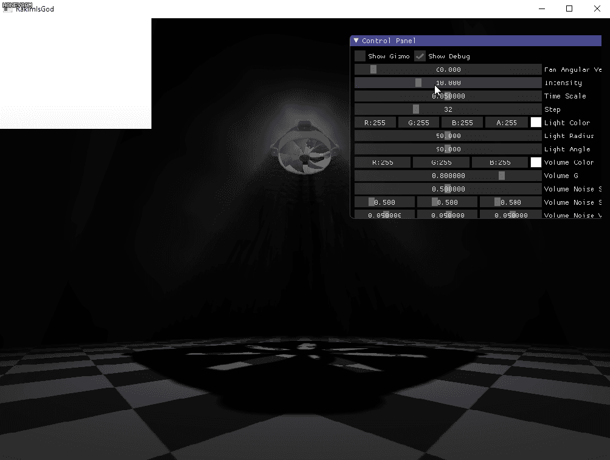

Features
======================

---

## I. Basic Renderer Functions

### overview

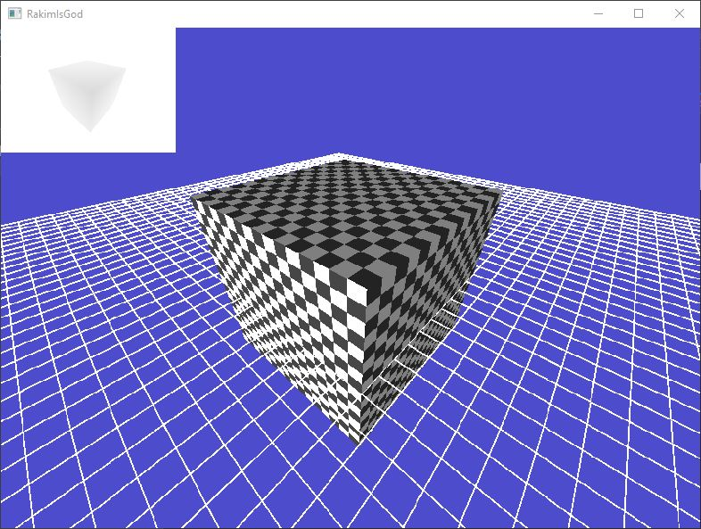

### details

* Render Texture

* Orbit Camera

* Gizmos

* Texture Mapping

* Basic Geometry

---

## II. Volume Fog

### overview

|     cube     |    sphere    |     cone     | 
|:------------:|:------------:|:------------:|
|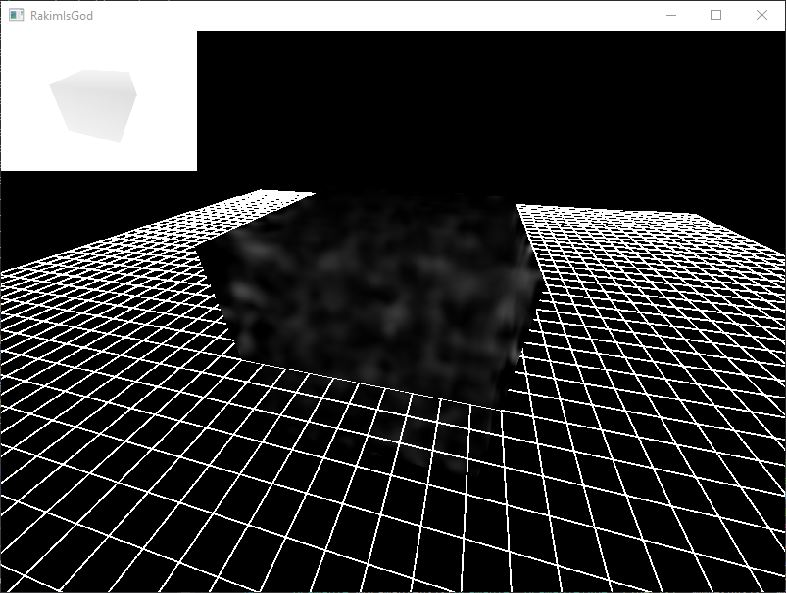|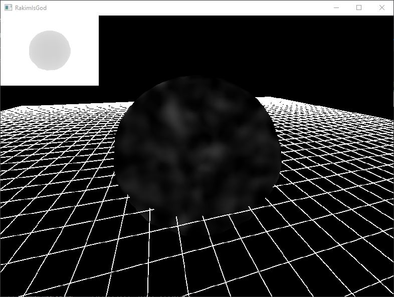|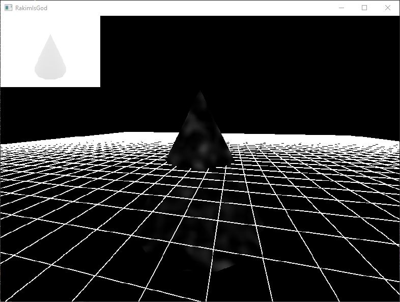|

|  geometry movement  |  light movement  | 
|:-------------------:|:----------------:|
|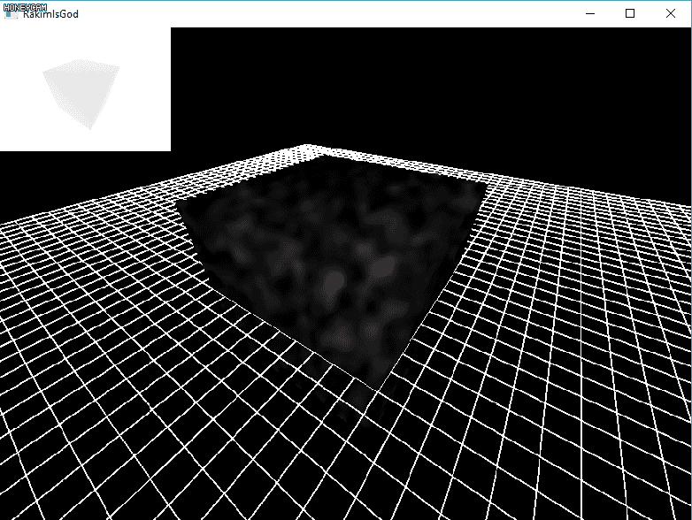       |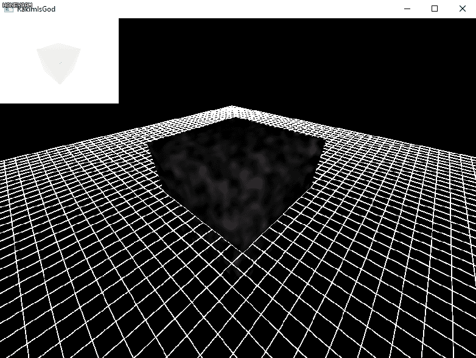    |

### details

When rendering the geometry, for each fragment of it, I calculate a ray from the camera to that fragment. Then I use the ray to intersect the geometry in the fragment shader and find the enter and exit position. Along the vector from enter to exit, find a fixed number of positions and use them to sample a 3D noise function as transmittance. Finally, plug the transmittance in to the scattering phase function to get the final scattering factor.

---

## III. Volume Light

### overview

|           cube          |           sphere          |           cone          | 
|:-----------------------:|:-------------------------:|:-----------------------:|
|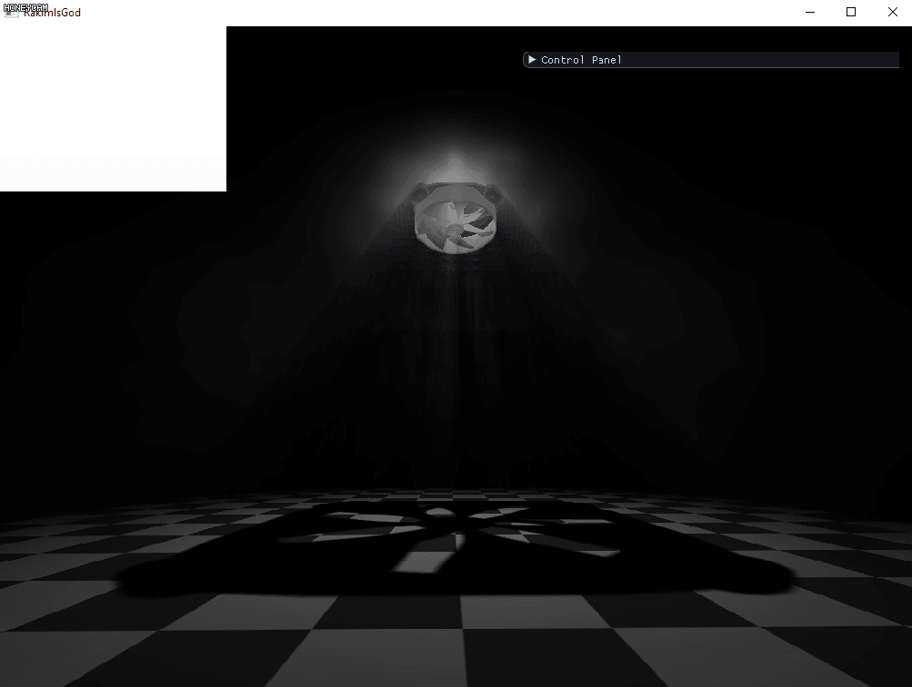|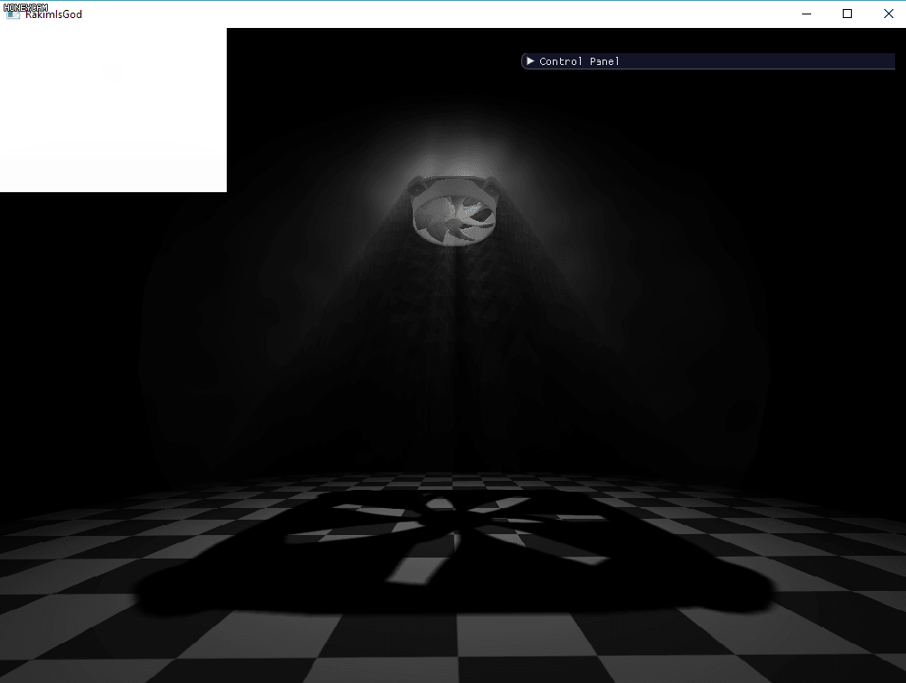|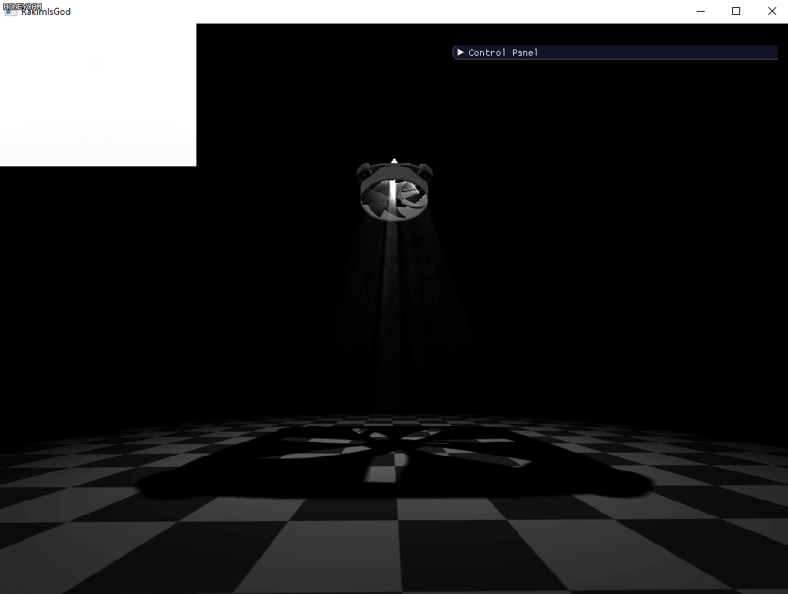|

|      camera movement      |       light movement       | 
|:-------------------------:|:--------------------------:|
|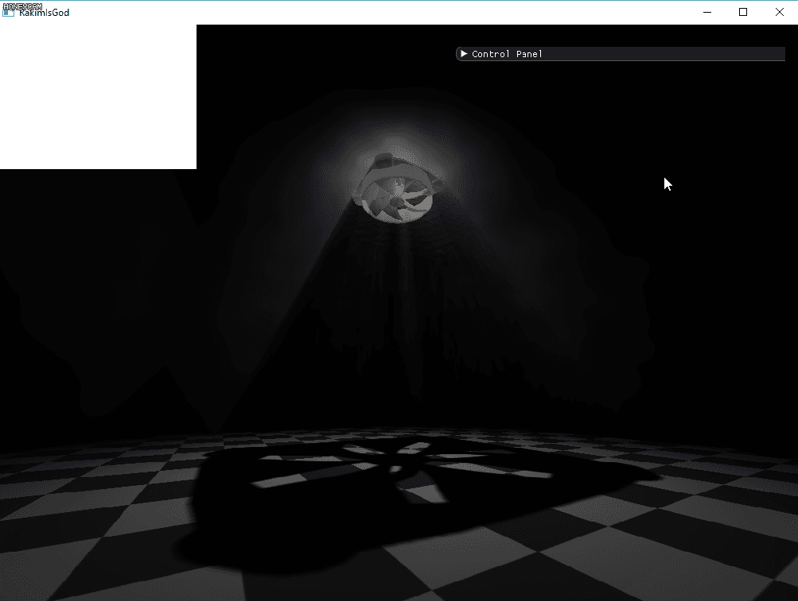||

### details

To make sure the volume will be rendered when the camera is inside of it, the culling mode is set to cull front face. To make sure the volume will be rendered when a object is inside of it, the depth test is disabled (as well as depth write). To get the correct enter and exit position of the ray intersecting the volume, (so that ray marching accumalates the correct amount of energy) the screen space depth is used to clamp the exit position and the camera position is used to clamp the enter position. 

---

### IV. What's Next?

- [ ] Dither Pattern

- [ ] Full Screen Volume (Quad)

- [ ] Other Light Types

  - [ ] Directional Light

  - [ ] Point Light

- [ ] Other Shadow Techniques

  - [ ] Variance Shadow Map

  - [ ] Percentage Close Soft Shadow

  - [ ] Adaptive Shadow Frustum
